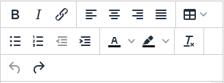

# Rich Text Fields
Allows for the rich text editor options for values of text fields. This extends the tinymce functionality that REDCap provides for the labels of fields.

This will allow for the text to appear as formatted in other locations that accepts HTML formatting. This includes email language and when being used in the label for other REDCap fields.

The following formatting options exist for this:

* Bold
* Italics
* Hyperlink
* Text Alignment (Left, Center, Right, Justify)
* Add Table
* Bullet / Numbered List
* Indent Increase/Decrease
* Text Color
* Background Color
